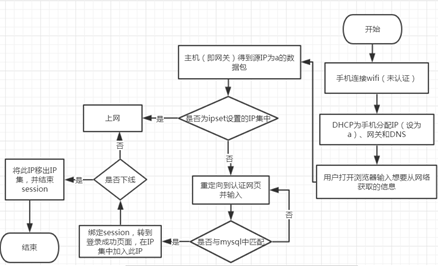

# Captive Portal

整个过程如图1，由于前提假设DHCP分配IP，剩下工作可分为三个部分：

-  **路由规则**：每来一个数据包，匹配其源ip是否在ipset设置的一个IP集中，是则放行；否则重定向到认证页面

--------------

- **认证服务器**：前端只有认证界面和认证成功的下线界面；后端将输入的账号密码与MySQL的wifi数据库的admin表比对，成功则转到认证成功界面并用exec函数将此IP放入IP集中，下线时调用exec将此IP移出IP集。同时设置session防止未登录直接访问登陆成功界面。

认证界面：                                    下线界面：

          

 

未登录访问下线界面（没有session）：

- **Web服务器的部署(lnmp)**。唉，docker太菜了，只能自己搭建（找找网上的安装lnmp的shell脚本）。注意将nginx开放端口改为8080

 

 

#### 评价&&优化

> 不够简洁，要是dockerfile就好了，唉，太菜。
>
> 每次php要在mysql匹配账号密码时间有点长，效率差。
>
> 明文传输账号密码太耿直了，可以md5之类的。
>
> 可以优化连接wifi后自动弹出认证网站，即不许再浏览器键入才弹出
>
>感觉可以把session删了，因为在这里面是用IP集来比对是否让其联网。
>
>如果有问题请大佬指正。
